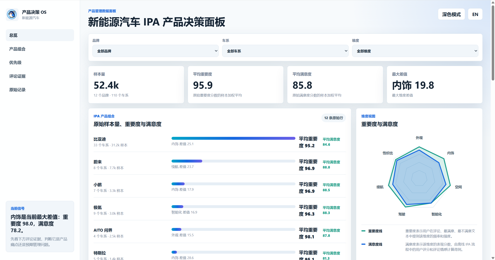
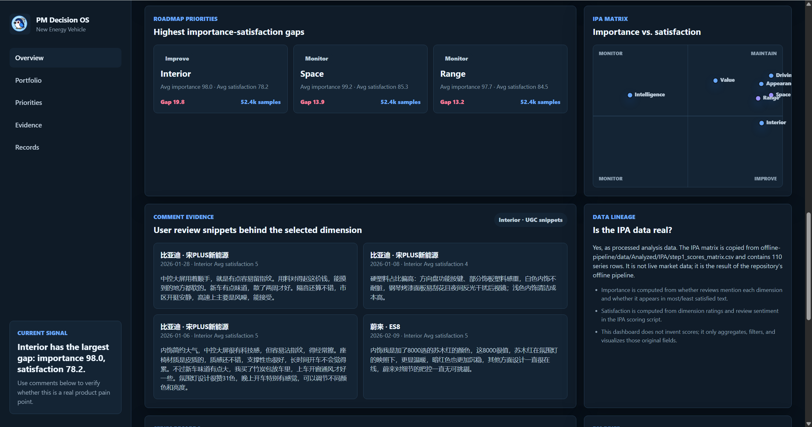

<div align="center">

# NEV-Product-Research-Kit

中文 | [English](README.md)

</div>

## 简介

`NEV-Product-Research-Kit` 是一个面向新能源乘用车市场的产品研究工具合集，包括离线工作流、数据面板与 skill。

基于 [SCSI-SLM-EV-Design](https://github.com/DonkeyKing01/SCSI-SLM-EV-Design)论文研究框架和方法指导，本项目着重展现工程实现、流程复现和实际研究协作，包含以下三个模块：

- `offline-pipeline/`：可离线数据采集、处理、建模、交互式设计服务工作流程
- `dashboard/`：基于整理后结果快照构建的决策辅助数据面板
- `nev-product-research/`：把原始证据转化为可溯源产品研究交付物的 Agent 方法 skill

## 模块

### 1. `offline-pipeline/`

离线流水线的核心工作流，包括：
- **数据输入与清洗重构**：整理车型参数、用户评论、竞品信息和公开资料的输入格式，强化数据清洗、字段统一和中间结果保存。
- **用户声音结构化**：延续原有 SSE 思路，将非结构化用户评论转化为产品维度、使用场景、情绪倾向、痛点和需求线索。
- **产品与用户映射分析**：延续原有 PUDM 思路，将产品侧表现与用户侧偏好进行对应分析，包括 IPA、用户画像和产品维度差异。
- **竞品与产品维度分析**：围绕价格、续航、补能、空间、舒适性、智能座舱、智驾等新能源汽车产品维度，整理竞品参数、用户感知和产品差异。
- **证据链与中间结果输出**：将用户原话、产品事实、模型推断和分析结论区分开，输出可追溯的中间表格和分析结果。
- **机会点识别输入**：基于用户痛点、产品表现和竞品缺口，为后续 dashboard 展示和产品调研报告提供结构化结果。

#### 架构图
<p align="center">
  
</p>

补充说明见 [offline-pipeline/README.md](offline-pipeline/README.md)。

### 2. `dashboard/`

`dashboard/` 是面向新能源汽车产品经理的数据理解与决策面板，用于快速浏览和解释离线流水线的关键结果。

#### 预览

<p align="center">
  
</p>

<p align="center">
  
</p>

### 3. `nev-product-research/`

`nev-product-research/` 是一个面向新能源乘用车产品与用户研究的 skill。

该 skill 参考 `offline-pipeline` 的方法逻辑，强调“先证据、后结论”的研究流程：

1. 定义研究边界
2. 联网收集证据
3. 统一证据结构
4. 建立产品侧模型
5. 建立用户侧模型
6. 诊断机会点
7. 生成交付物

#### 案例

本项目提供了一个基于 `nev-product-research` 生成的示例案例，用于展示该 skill 如何从一个较短的产品调研问题出发，逐步完成 Scope 定义、证据整理、产品侧建模、用户侧建模、机会点诊断和最终报告生成。

示例问题为：

> 在 20-30 万元新能源家庭 SUV 市场中，家庭用户的长途出行体验有哪些产品机会？

示例输出位于 [docs/examples](./docs/examples/)，展示了从 Research Scope、Evidence Collection、Product Model、User Model、Opportunity Cards 到 Final Report 的完整生成结果。

该示例用于说明 Skill 的执行流程和交付物格式，不代表唯一的调研问题或固定模板。


## 仓库结构

```text
.
|-- dashboard/
|-- docs/
|   |-- examples/
|   `-- images/
|-- nev-product-research/
|   |-- agents/
|   |-- references/
|   |-- scripts/
|   `-- workflows/
|-- offline-pipeline/
|   |-- analysis/
|   |-- crawler/
|   |-- data/
|   |-- graph/
|   |-- process/
|   |-- rag/
|   `-- vector/
|-- README.md
`-- README.zh-CN.md
```

## 快速开始

### offline-pipeline

详见 [offline-pipeline/README.md](offline-pipeline/README.md)。

### dashboard

直接打开 `dashboard/index.html` 即可。

### nev-product-research-skill

#### Codex

```bash
git clone https://github.com/DonkeyKing01/nev-product-search-kit.git
cp -r nev-product-search-kit/nev-product-research ~/.codex/skills/nev-product-research
```
#### Claude Code
```bash
git clone https://github.com/DonkeyKing01/nev-product-search-kit.git
cp -r nev-product-search-kit/nev-product-research ~/.claude/skills/nev-product-research
```
#### 手动安装

保留以下目录结构，并将 nev-product-research-skill/ 复制到对应 Agent 的 skills 目录中：
```bash
nev-product-research-skill/
  workflows/
  templates/
  scripts/
```

## 许可证

MIT
